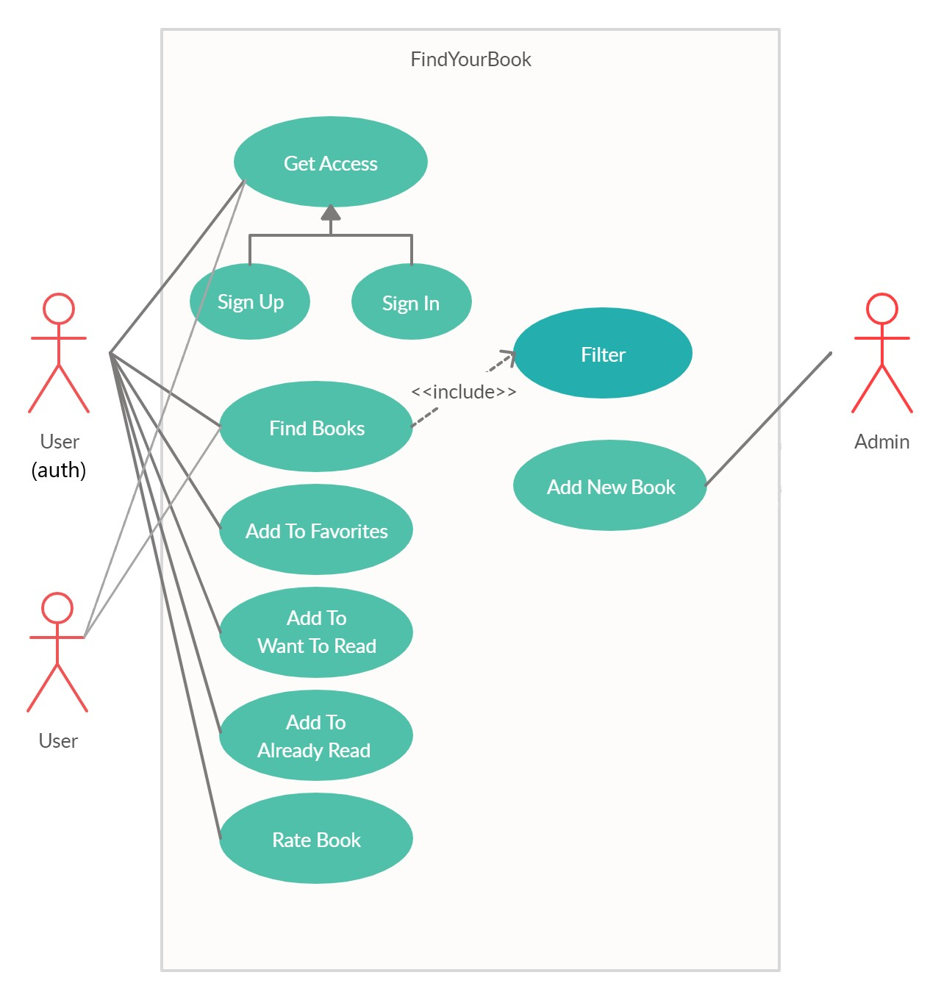
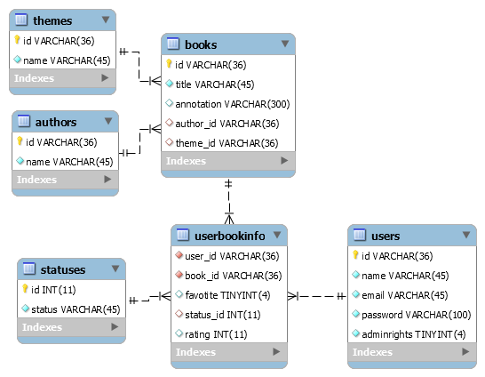

# Lab1
Приложение для подбора книг.
Цель работы: упростить процесс поиска подходящей пользователю книги, а также организовать читательские предпочтения пользователя.

Функциональные требования:
 - должно быть разделение пользователей на авторизованных и не авторизованных;
 - авторизованные пользователи могут иметь права суперпользователя (администратора);
 - возможности неавторизованного пользователя:
 -- просматривать все книги, доступные в приложении, а также основную информацию о них и рейтинг, составленный авторизованными пользователями;
 -- искать книги в каталоге и фильтровать;
 - возможности авторизованного пользователя (не администратора):
 -- возможности неавторизованного пользователя;
 -- добавлять книги в избранное;
 -- добавлять книгам статус (прочитано, хочу прочитать);
 -- ставить оценку книге;
 -- просматривать добавленные книги;
 - возможности администратора:
 -- добавлять новые книги в каталог.

## Use-Case

## ER диаграмма

## Launch
docker-compose up --build [-- scale backend=3]

scaling for load balancer

http://localhost:80/api/v1 for backend
